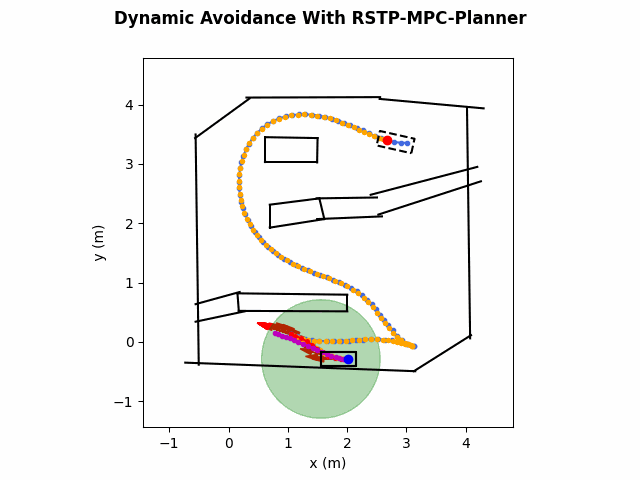
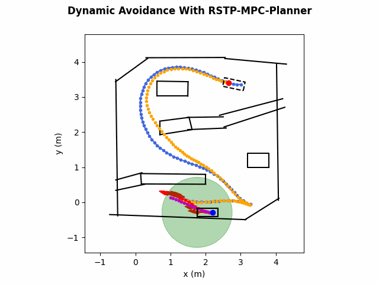

# MPC Planner

Deploy and visualize the trajectory planner in paper "[Rapid and Safe Trajectory Planning over Diverse Scenes through Diffusion Composition](https://arxiv.org/abs/2507.04384)".

Do you find that tuning dynamic collision-avoidance parameters is often time-consuming and tedious? Try our work on diffusion composition — it enables test-time decision-making to produce safe behaviors, such as accelerating to bypass obstacles or decelerating to avoid them, thereby enabling safe trajectory planning for diverse scenarios without the need for extra parameter tuning!

<div style="display: flex; justify-content: flex-start;">
	
  
  
</div>

<div style="display: flex; justify-content: flex-start;">
  <video src="./assets/static_collision.mp4" alt="video 1" width="25%" style="margin-right: 10px;" controls></video>
  <video src="./assets/dynamic_collision.mp4" alt="video 2" width="25%" controls></video>
  <video src="./assets/compose.mp4" alt="video 3" width="25%" controls></video>
</div>


# 🪄 Quickstart

TBA

```bash
conda create -n rstp-mpc python=3.8
conda activate rstp-mpc
pip install -r requirements.txt
python scripts/mpc_planner.py
```

## 🤗 Acknowledgments

- [Vehicle_Motion_Planning_with_Obstacles_Avoidance_using_MPC](https://github.com/tg623623nana/Vehicle_Motion_Planning_with_Obstacles_Avoidance_using_MPC)
- [AutomatedValetParking](https://github.com/wenqing-2021/AutomatedValetParking)

Please contact [Zhouheng Li](https://zhouhengli.github.io/) if you have any questions or suggestions.

## Citations

If you find our work useful, please consider citing:

```
@article{mao2025rapid, 
	title={Rapid and Safe Trajectory Planning over Diverse Scenes through Diffusion Composition}, 
	author={Mao, Wule and Li, Zhouheng and Luo, Yunhao and Du, Yilun and Xie, Lei}, 
	journal={arXiv preprint arXiv:2507.04384}, 
	year={2025} 
}
```

